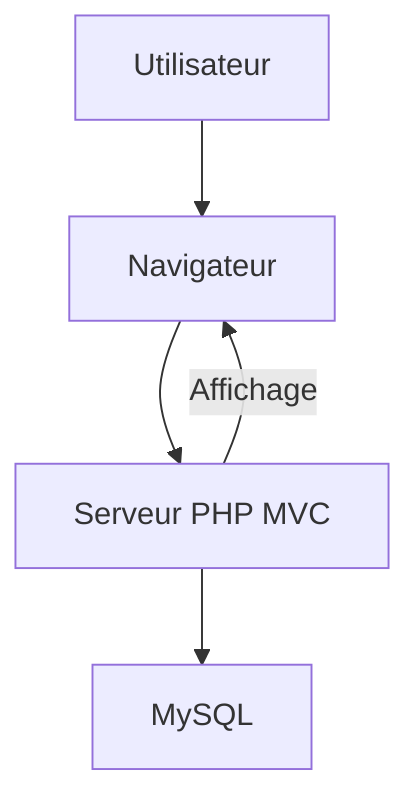

# `Shoes Shop - Front Office`

## Description du projet

Site e-commerce : une boutique de chaussures.
Le BackOffice/API est dans un autre repository

- Affichage catalogue (catégories, types, marques, produits)
- Filtres, pagination, navigation
- Intégration HTML/CSS/Bootstrap
- Connexion à une base de données MySQL
- Pas de gestion back-office dans ce dépôt (gérée ailleurs)

## Problèmes résolus

- Centralisation de l’offre produits
- Navigation simple par catégories, types, marques
- Présentation claire des informations produits

## Fonctionnement attendu

- Accès rapide à l’ensemble du catalogue
- Filtres efficaces (nom, note, prix)
- Pages dédiées pour chaque entité (catégorie, type, marque, produit)

## Objectifs UX

- Navigation intuitive
- Temps de chargement rapide
- Responsive design
- Accessibilité

## 1. Type de projet

- **Type principal** : PHP (architecture MVC personnalisée)
- **Front-end** : HTML/CSS/JS statique, pas de framework JS moderne détecté
- **Backend** : PHP, structure orientée contrôleur-modèle-vue
- **Gestion de dépendances** : `composer.json` (PHP Composer)
- **Pas de microservices** : Structure monolithique
- **Pas de monorepo** : Un seul projet principal

## 2. Vue d’ensemble structurelle

- **Organisation par couche** :
  - Contrôleurs (logique de routage)
  - Modèles (accès aux données)
  - Vues (affichage)
- **Organisation des assets** :
  - Séparation claire entre code source, ressources statiques et documentation
- **Répétition de motifs** :
  - Fichiers `.tpl.php` pour chaque vue
  - Modèles et contrôleurs nommés selon l’entité métier

## Diagramme d’architecture (Mermaid)



## 3. Visualisation de l’arborescence

```md
├── 📁 app/
│   ├── 📁 Controllers/
│   │   ├── 🐘 CatalogController.php
│   │   ├── 🐘 CoreController.php
│   │   ├── 🐘 ErrorController.php
│   │   └── 🐘 MainController.php
│   ├── 📁 Models/
│   │   ├── 🐘 Brand.php
│   │   ├── 🐘 Category.php
│   │   ├── 🐘 CoreModel.php
│   │   ├── 🐘 Product.php
│   │   └── 🐘 Type.php
│   ├── 📁 Utils/
│   │   └── 🐘 Database.php
│   ├── 📁 views/
│   │   ├── 🐘 catalog-brand.tpl.php
│   │   ├── 🐘 catalog-category.tpl.php
│   │   ├── 🐘 catalog-type.tpl.php
│   │   ├── 🐘 error404.tpl.php
│   │   ├── 🐘 footer.tpl.php
│   │   ├── 🐘 header.tpl.php
│   │   ├── 🐘 home.tpl.php
│   │   ├── 🐘 legal-notices.tpl.php
│   │   ├── 🐘 product.tpl.php
│   │   └── 🐘 test.tpl.php
│   └── 📄 .htaccess
├── 📁 docs/
│   ├── 🗄️ database.sql
│   ├── 📝 dictionnaire-de-donnees.md
│   ├── 📝 modelisation_bdd.md
│   ├── 📝 process-composer.md
│   ├── 📝 routes.md
│   └── 📝 user_stories.md
├── 📁 public/
│   ├── 📁 assets/
│   │   ├── 📁 css/
│   │   │   ├── 🎨 bootstrap.min.css 🚫 (auto-hidden)
│   │   │   ├── 🎨 font-awesome.min.css 🚫 (auto-hidden)
│   │   │   └── 🎨 styles.css
│   │   ├── 📁 fonts/
│   │   │   ├── 📄 FontAwesome.otf
│   │   │   ├── 📄 fontawesome-webfont.eot
│   │   │   ├── 🖼️ fontawesome-webfont.svg
│   │   │   ├── 📄 fontawesome-webfont.ttf
│   │   │   ├── 📄 fontawesome-webfont.woff
│   │   │   └── 📄 fontawesome-webfont.woff2
│   │   ├── 📁 images/
│   │   │   ├── 📁 produits/
│   │   │   │   └── 🖼️ ... .jpg
│   │   │   └── 🖼️ ... .jpg
│   │   └── 📁 js/
│   │       ├── 📄 app.js
│   │       ├── 📄 bootstrap.min.js 🚫 (auto-hidden)
│   │       ├── 📄 jquery.min.js 🚫 (auto-hidden)
│   │       └── 📄 popper.min.js 🚫 (auto-hidden)
│   ├── 📄 .htaccess
│   └── 🐘 index.php
├── 🚫 .gitignore
├── 📖 README.md
├── 📄 composer.json
├── 🔒 composer.lock 🚫 (auto-hidden)
└── 🐚 import-external-repo.sh 🚫 (auto-hidden)
```

## 4. Analyse des dossiers clés

### app/

- **Controllers/** : Logique de routage, un contrôleur par domaine métier
- **Models/** : Accès aux données, une classe par table principale
- **Utils/** : Utilitaires partagés (ex : connexion BDD)
- **views/** : Templates d’affichage, un fichier par vue ou page

### public/

- **index.php** : Point d’entrée de l’application
- **assets/** : Ressources statiques (CSS, JS, images, polices)

### docs/

- Documentation technique, scripts SQL, guides de modélisation

## 5. Motifs de placement des fichiers

- **Fichiers de config** : Racine (`composer.json`), `public/index.php`
- **Modèles** : `app/Models/`
- **Contrôleurs** : `app/Controllers/`
- **Vues** : `app/views/`
- **Assets** : `public/assets/`
- **Tests** : Non détecté (à ajouter si besoin)
- **Documentation** : `docs/`

## 6. Conventions de nommage et d’organisation

- **Fichiers** : PascalCase pour classes PHP, kebab-case pour assets statiques
- **Dossiers** : CamelCase pour dossiers de code, minuscules pour assets
- **Templates** : Suffixe `.tpl.php` pour les vues
- **Organisation** : Par couche (MVC), chaque entité a son modèle, contrôleur, vue

## 7. Navigation et workflow de développement

- **Point d’entrée** : `public/index.php`
- **Ajout de fonctionnalités** :
  - Nouveau modèle dans `app/Models/`
  - Nouveau contrôleur dans `app/Controllers/`
  - Nouvelle vue dans `app/views/`
- **Modification de la config** : `composer.json`, `public/index.php`
- **Ajout d’assets** : `public/assets/`
- **Documentation** : Ajouter dans `docs/`

## 8. Organisation du build et des outputs

- **Build** : Pas de build automatisé détecté (projet PHP classique)
- **Sortie** : Fichiers servis depuis `public/`
- **Différences dev/prod** : Non gérées nativement (à documenter si besoin)

## 9. Organisation spécifique PHP

- **Organisation des classes** : Un fichier par classe, nom du fichier = nom de la classe
- **Gestion des dépendances** : Composer (`composer.json`)
- **Ressources** : Statique dans `public/assets/`, dynamique via modèles

## 10. Extension et évolution

- **Extension** : Ajouter de nouveaux modèles/contrôleurs/vues selon la convention existante
- **Scalabilité** : Possibilité de regrouper par domaine si le projet grandit
- **Refactoring** : Extraire des utilitaires dans `app/Utils/`, factoriser les vues communes

## 11. Templates de structure (exemples)

### Nouveau modèle

- `app/Models/NomDuModele.php`

### Nouveau contrôleur

- `app/Controllers/NomDuControleur.php`

### Nouvelle vue

- `app/views/nom-de-la-vue.tpl.php`

### Nouvel asset

- `public/assets/css/nom-style.css`
- `public/assets/js/nom-script.js`

## 12. Enforcement de la structure

- **Validation** : Convention manuelle, pas d’outil d’enforcement détecté
- **Documentation** : Historique et décisions dans `docs/`
- **Évolution** : Mettre à jour ce blueprint à chaque refonte structurelle

## Exemples de code

### Contrôleur

```php
class ProductController extends CoreController {
    public function list() {
        $products = Product::findAll();
        require 'app/views/product.tpl.php';
    }
}
```

### Modèle

```php
class Product extends CoreModel {
    public static function findAll() {
        // ... requête SQL et retour des résultats
    }
}
```

### Vue

```php
<!-- app/views/product.tpl.php -->
<?php foreach ($products as $product): ?>
  <div><?= htmlspecialchars($product->name) ?></div>
<?php endforeach; ?>
```

## Guide d’extension et d’évolution

- **Ajout d’une entité métier** :
  - Créer un modèle dans `app/Models/` (ex : `Order.php`)
  - Créer un contrôleur dans `app/Controllers/` (ex : `OrderController.php`)
  - Créer une ou plusieurs vues dans `app/views/` (ex : `order-list.tpl.php`, `order-detail.tpl.php`)
  - Ajouter la route correspondante dans la configuration du routeur
  - Documenter la nouvelle fonctionnalité dans le Memory Bank et le `README.md`

- **Ajout d’un asset** :
  - Placer les fichiers CSS dans `public/assets/css/`
  - Placer les fichiers JS dans `public/assets/js/`
  - Placer les images dans `public/assets/images/`

- **Ajout d’une dépendance PHP** :
  - Ajouter la dépendance dans `composer.json`
  - Exécuter `composer install`
  - Documenter l’usage de la dépendance dans le Memory Bank

## Bonnes pratiques et pièges à éviter

> [!WARNING]
>
> - Ne jamais placer de logique métier dans les vues
> - Ne pas coupler directement les modèles et les vues
> - Toujours valider les entrées côté serveur (dans les contrôleurs ou modèles)
> - Garder une documentation à jour pour chaque évolution
> - Utiliser le Memory Bank comme source unique de vérité pour l’architecture et les décisions

## FAQ et ressources complémentaires

- **Installation** : Voir le `README.md` pour les prérequis et la procédure d’installation
- **Modélisation BDD** : Voir `docs/modelisation_bdd.md` pour le schéma conceptuel et logique
- **User stories** : Voir `docs/user_stories.md`
- **Intégration HTML/CSS** : Voir `docs/html-css/`

---

*Pour toute contribution, merci de respecter la structure, les conventions et de documenter vos changements dans le Memory Bank.*
