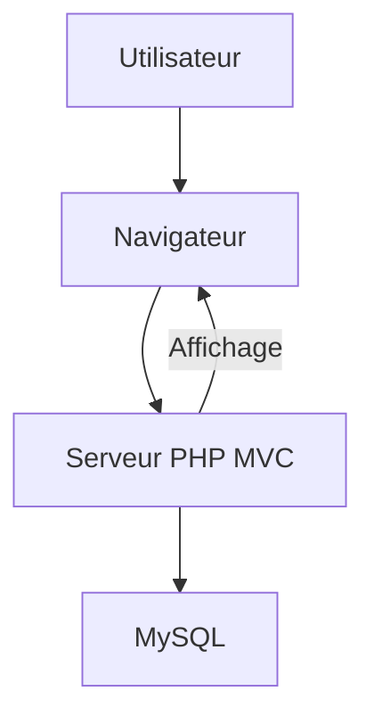

# Documentation Technique – Shoes Shop Frontoffice

## Vue d’ensemble de l’architecture

- **Type de projet** : Application web frontoffice pour une boutique de chaussures, basée sur PHP (pattern MVC), MySQL, HTML/CSS, Bootstrap, et JavaScript (jQuery, Popper.js).
- **Pattern architectural** : MVC monolithique, organisation stricte par couche (Contrôleurs, Modèles, Vues).
- **But** : Permettre la navigation, la recherche et la consultation de produits, catégories, marques et types, avec une expérience utilisateur moderne et responsive.

## Structure des dossiers

- `app/` : Code source principal (contrôleurs, modèles, vues, utilitaires)
  - `Controllers/` : Logique de routage et orchestration métier
  - `Models/` : Accès aux données et logique métier
  - `views/` : Templates d’affichage (un `.tpl.php` par page ou composant)
  - `Utils/` : Fonctions utilitaires (ex : connexion BDD)
- `public/` : Point d’entrée (`index.php`) et ressources statiques
  - `assets/` : CSS, JS, images, polices
- `docs/` : Documentation technique, scripts SQL, guides de modélisation
- Fichiers racine : `composer.json` (dépendances PHP), `README.md` (guide projet)

## Composants principaux

### Contrôleurs (`app/Controllers/`)

- **Responsabilité** : Reçoivent les requêtes, orchestrent la logique métier, sélectionnent la vue à afficher.
- **Exemples** : `CatalogController.php`, `MainController.php`
- **Extension** : Ajouter un contrôleur pour chaque nouveau domaine métier.

### Modèles (`app/Models/`)

- **Responsabilité** : Encapsulent l’accès aux données (MySQL via PDO), portent la logique métier.
- **Exemples** : `Product.php`, `Category.php`, `Brand.php`, `Type.php`
- **Extension** : Ajouter un modèle pour chaque nouvelle entité/table.

### Vues (`app/views/`)

- **Responsabilité** : Présentation HTML, reçoivent les données des contrôleurs.
- **Convention** : Un fichier `.tpl.php` par page ou composant d’interface.
- **Extension** : Ajouter une vue pour chaque nouvelle page ou composant.

### Utilitaires (`app/Utils/`)

- **Responsabilité** : Fonctions partagées (ex : gestion de la connexion à la base de données).
- **Exemple** : `Database.php`

## Relations et flux de données

- **Flux principal** : Contrôleur → Modèle → Base de données → Modèle → Contrôleur → Vue
- **Règles** :
  - Les vues ne connaissent pas les modèles.
  - Les modèles n’appellent pas les vues.
  - Les contrôleurs orchestrent toutes les interactions.

## Patterns et choix techniques

- **MVC strict** : Séparation claire des responsabilités.
- **Un fichier par classe** : Facilite la maintenance et l’extension.
- **Routage centralisé** : Utilisation d’AltoRouter pour le mapping URL → contrôleur/action.
- **Composer** : Autoloading et gestion des dépendances PHP.
- **Assets** : Bootstrap, jQuery, Popper.js inclus comme fichiers minifiés standards.

## Exemples de code

### Contrôleur

```php
class ProductController extends CoreController {
    public function list() {
        $products = Product::findAll();
        require 'app/views/product.tpl.php';
    }
}
```

### Modèle

```php
class Product extends CoreModel {
    public static function findAll() {
        // ... requête SQL et retour des résultats
    }
}
```

### Vue

```php
<!-- app/views/product.tpl.php -->
<?php foreach ($products as $product): ?>
  <div><?= htmlspecialchars($product->name) ?></div>
<?php endforeach; ?>
```

## Configuration et environnement

- **Configuration BDD** : `config.ini` (non versionné, à créer à partir d’un exemple)
- **Dépendances PHP** : `composer install`
- **Environnement recommandé** : Apache/Nginx, PHP 7.x+, MySQL

## Tests et qualité

- **Tests automatisés** : Non présents (à ajouter pour robustesse)
- **Stratégie recommandée** :
  - Tests unitaires sur les modèles
  - Tests fonctionnels sur les contrôleurs
  - Tests d’intégration via scripts externes

## Extension et personnalisation

- **Ajout de fonctionnalités** :
  - Créer un modèle, un contrôleur, une vue selon la convention MVC
  - Ajouter la route correspondante dans le routeur
- **Refactoring** :
  - Extraire des utilitaires dans `app/Utils/`
  - Factoriser les vues communes
- **Scalabilité** :
  - Possibilité de regrouper par domaine si le projet grandit

## Décisions et gouvernance

- **Pattern MVC choisi** pour la simplicité et la clarté
- **Séparation front/back** : le back-office/API est dans un autre dépôt
- **Documentation** : Maintenue dans `README.md`, `docs/` et le Memory Bank
- **Revue manuelle** lors des ajouts majeurs

## Onboarding et bonnes pratiques

- Lire le `README.md` pour l’installation et la prise en main
- Respecter la structure MVC et les conventions de nommage
- Documenter toute nouvelle fonctionnalité ou modification majeure
- Mettre à jour le Memory Bank pour garantir la continuité documentaire

## Diagramme d’architecture (Mermaid)



---

## Documentation de la couche métier (Business Logic Layer)

---

## Component Name

**Product Management (Gestion des Produits)**

### Purpose

- Permettre la gestion, l’affichage et la consultation des produits de la boutique en ligne.
- Représente le cœur du domaine e-commerce : l’offre produits.

### Key Responsibilities

- Afficher la liste des produits selon différents critères (catégorie, type, marque).
- Gérer la pagination et le filtrage (par nom, note, prix).
- Afficher le détail d’un produit sélectionné.
- Garantir que seules les entités valides sont affichées (produits actifs, catégories existantes, etc.).

### Workflows / Use Cases

- **Navigation catalogue** : L’utilisateur sélectionne une catégorie/type/marque → le système affiche la liste correspondante, paginée et filtrable.
- **Consultation produit** : L’utilisateur clique sur un produit → le système affiche la fiche détaillée du produit.
- **Mise en avant** : Sur la page d’accueil, certaines catégories sont mises en avant selon une logique métier (ordre, sélection manuelle).

### Inputs and Outputs

- **Inputs** : Identifiants de catégorie, type, marque, critères de filtre (nom, note, prix), pagination.
- **Outputs** : Listes de produits, fiche produit détaillée, messages d’erreur si entité non trouvée.

### Dependencies

- Modèles de données : `Product`, `Category`, `Brand`, `Type` (accès BDD via PDO).
- Contrôleurs pour l’orchestration des flux.
- Vues pour l’affichage des résultats.

### Business Rules & Constraints

- Un produit n’est affiché que s’il est actif (statut).
- Les filtres ne s’appliquent qu’aux produits de la catégorie/type/marque sélectionné(e).
- Pagination : nombre fixe d’éléments par page.
- Les catégories mises en avant sont limitées à 5 sur la page d’accueil.

### Design Considerations

- Séparation stricte entre logique métier (modèles) et présentation (vues).
- Les contrôleurs orchestrent les appels et gèrent les cas d’erreur (ex : produit non trouvé).
- Risque : absence de validation avancée côté serveur (à renforcer pour éviter les incohérences).
- Extensible pour ajouter d’autres critères de filtre ou de nouvelles entités métier.

---

## Component Name

**Category, Brand, and Type Management (Gestion des Catégories, Marques, Types)**

### Purpose

- Permettre la navigation et le filtrage des produits par catégorie, marque ou type.
- Représente la structuration de l’offre produits pour l’utilisateur.

### Key Responsibilities

- Afficher la liste des catégories, marques, types disponibles.
- Permettre la navigation vers les produits associés à chaque entité.
- Garantir la cohérence des liens entre produits et entités.

### Workflows / Use Cases

- **Navigation par entité** : L’utilisateur sélectionne une catégorie/marque/type → le système affiche la liste des produits associés.
- **Affichage des entités** : Sur la page d’accueil ou dans le menu, afficher toutes les catégories, marques, types disponibles.

### Inputs and Outputs

- **Inputs** : Identifiant de catégorie, marque, type.
- **Outputs** : Listes d’entités, listes de produits filtrées.

### Dependencies

- Modèles : `Category`, `Brand`, `Type`, `Product`.
- Contrôleurs pour la gestion des flux.
- Vues pour l’affichage.

### Business Rules & Constraints

- Une entité ne peut être affichée que si elle existe et est active.
- Les produits affichés doivent appartenir à l’entité sélectionnée.

### Design Considerations

- Les entités sont gérées indépendamment pour faciliter l’ajout ou la suppression.
- Risque : navigation cassée si entité supprimée sans mise à jour des produits associés.

---

## Component Name

**Homepage Highlight Logic (Mise en avant sur la page d’accueil)**

### Purpose

- Mettre en avant certaines catégories sur la page d’accueil pour guider l’utilisateur.

### Key Responsibilities

- Sélectionner et afficher jusqu’à 5 catégories en page d’accueil.
- Garantir la diversité et la pertinence des catégories mises en avant.

### Workflows / Use Cases

- **Affichage d’accueil** : Au chargement de la page d’accueil, le système sélectionne les catégories à mettre en avant et affiche leurs visuels.

### Inputs and Outputs

- **Inputs** : Données de configuration ou attributs de catégorie (ordre d’affichage, flag “home”).
- **Outputs** : Liste des catégories à mettre en avant.

### Dependencies

- Modèle `Category`.
- Contrôleur principal (ex : `MainController`).
- Vue d’accueil.

### Business Rules & Constraints

- Maximum 5 catégories affichées.
- Les catégories doivent être actives et avoir un visuel associé.

### Design Considerations

- Permet une gestion flexible (ordre, sélection manuelle).
- Risque : page d’accueil vide si aucune catégorie n’est marquée comme “home”.

---

## Component Name

**Error Handling (Gestion des erreurs métier)**

### Purpose

- Garantir une expérience utilisateur cohérente en cas d’erreur métier (entité non trouvée, produit inactif, etc.).

### Key Responsibilities

- Afficher une page d’erreur dédiée (404, etc.) en cas de problème métier.
- Ne jamais exposer d’informations techniques à l’utilisateur final.

### Workflows / Use Cases

- **Erreur de navigation** : L’utilisateur tente d’accéder à une entité inexistante → affichage d’une page d’erreur claire.
- **Produit inactif** : L’utilisateur tente d’accéder à un produit désactivé → affichage d’un message d’indisponibilité.

### Inputs and Outputs

- **Inputs** : Identifiants invalides, statuts d’entités.
- **Outputs** : Pages d’erreur, messages d’information.

### Dependencies

- Contrôleur d’erreur (`ErrorController`).
- Vues d’erreur dédiées.

### Business Rules & Constraints

- Ne jamais afficher d’informations sensibles.
- Rediriger ou informer l’utilisateur de façon claire et non technique.

### Design Considerations

- Centralisation de la gestion des erreurs pour faciliter la maintenance.
- Risque : couverture incomplète des cas d’erreur métier (à compléter au fil des évolutions).

---
